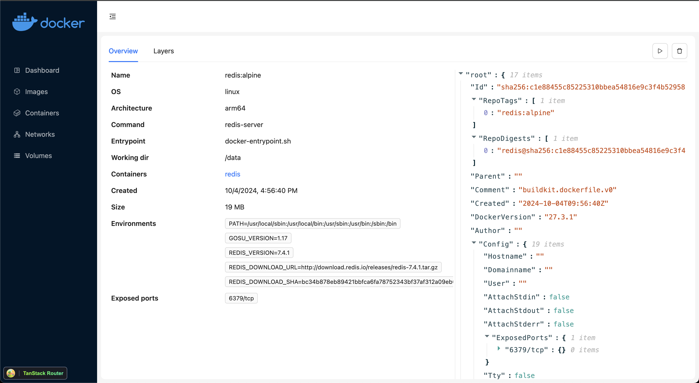

# Docker UI

[](https://github.com/magiskboy/docker-ui/actions/workflows/ci.yml)
[](https://github.com/magiskboy/docker-ui/actions/workflows/release.yml)


## How to use?

```bash
$ docker run -dit --name docker-ui -v /var/run/docker.sock:/var/run/docker.sock -p3000:3000 nguyenkhacthanh/docker-ui:v1.0.0
```


## Screenshots




